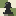

# 👾 Pixel Board

**Pixel Board** is an arcade-style, web-based gaming platform that brings classic board games to life with a stunning retro pixel-art aesthetic and dynamic multiplayer capabilities.



## ✨ Features

- **Classic Board Games:** Play fully-featured versions of **Chess** and **Checkers** (Damas). More games like Go coming soon!
- **Real-Time Multiplayer:** Built-in matchmaking using WebSockets. Play instantly with anyone around the world!
- **Play as Guest:** Jump straight into the action with instant guest accounts. No password required.
- **Bot AI:** Practice your strategies offline by playing against the computer.
- **Retro Aesthetic:** Custom-generated pixel art pieces, smooth animations, drop-shadows, and a gorgeous CRT/arcade-style UI.

## 🛠️ Tech Stack

### Frontend (`/Pixel-Board`)
- **React + Vite:** Fast, modern frontend framework.
- **Vanilla CSS:** Custom-built retro design system and animations.
- **Socket.io-client:** Real-time bi-directional communication.
- **chess.js:** Handles complex chess move validation.

### Backend (`/backend`)
- **Node.js + Express:** Robust backend server.
- **Socket.io:** Handles matchmaking queues and real-time move broadcasting.
- **Prisma + SQLite:** Database management for user accounts and statistics.
- **JWT + bcrypt:** Secure authentication system.

## 🚀 Running Locally

To run this project on your machine, you need [Node.js](https://nodejs.org/) installed. You will need to start both the backend and frontend servers in separate terminals.

### 1. Start the Backend Server
```bash
cd backend
npm install
npm run dev
```
The backend will run on `http://localhost:3001`.

### 2. Start the Frontend Server
Open a new terminal window:
```bash
cd Pixel-Board
npm install
npm run dev
```
The frontend will run on `http://localhost:5173`.

